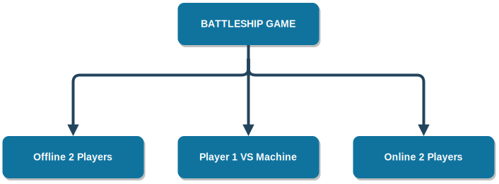

# battleship-game
Battleship game (C/C++ programming) is my project in the course Techniques of Programming at Hanoi University of Science and Technology.

- Team Lead.  New battleship game with three modes, featuring LAN party, versus machine, auditory and visual user interface.  C, C++.

Contact me if you have any problem with it. Please give me a ⭐ if you find it useful.

